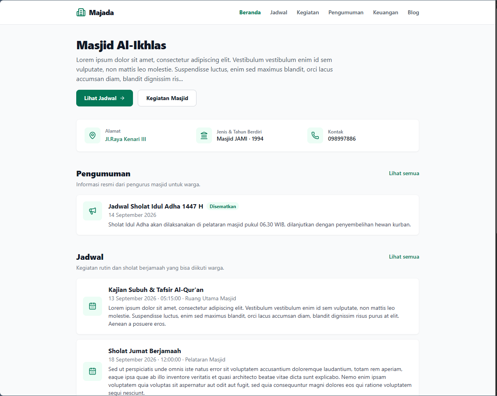
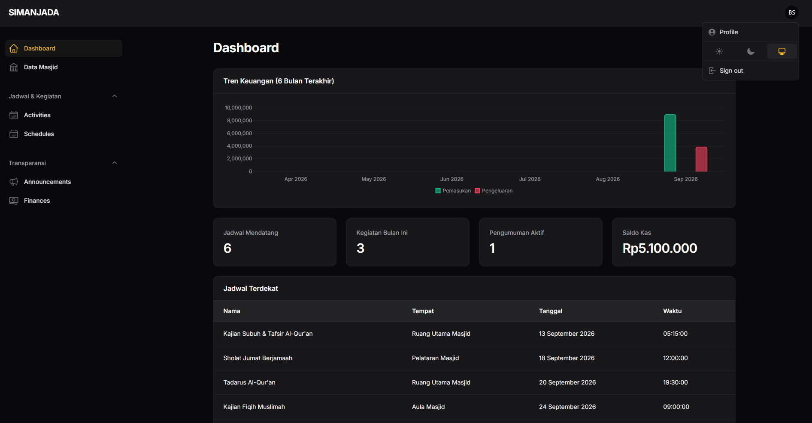

# Majada

[](https://php.net)
[](https://laravel.com)
[](https://filamentphp.com)
[](#license)

Mosque schedule and profile management system, built on Laravel 12
(Sistem Informasi Jadwal dan Daftar Masjid / SIMANJADA).

Majada is the second generation of this application, previously built on
CodeIgniter 2.2.6. The current scope covers a single mosque's profile,
prayer schedule, and activities.

## Contents

- [Overview](#overview)
- [Requirements](#requirements)
- [Installation](#installation)
- [Usage](#usage)
- [Tech stack](#tech-stack)
- [Support](#support)
- [License](#license)

## Overview

Majada manages a mosque's profile, schedule, and activities across three
user roles:

| Role | Access |
|---|---|
| **Super Admin** | Manages the mosque profile and the article/blog content. |
| **DKM** | The mosque committee. Manages the mosque's profile, prayer schedule, activities, finances, and announcements. |
| **Public** | Read-only access to the mosque profile, prayer schedule, activities, announcements, financial summary, and articles. No login required. |

## Requirements

| Requirement | Used during development | Minimum |
|---|---|---|
| PHP | 8.3.29 | ^8.3 |
| Composer | 2.9.3 | ^2.x |
| Node.js | v24.13.0 | ^20 LTS |
| npm | 11.6.2 | ^10.x |
| MySQL | 8.0.30 | 5.7+ / 8.0+ |

## Installation

1. Clone the repository and install dependencies:

   ```bash
   composer install
   npm install
   ```

2. Copy `.env.example` to `.env` and point the `DB_*` variables at an
   existing MySQL database.

3. Run migrations and seed the database:

   ```bash
   php artisan migrate:fresh --seed
   ```

4. Start the app:

   ```bash
   php artisan serve
   ```

5. The app is ready. See [Usage](#usage) below for login URLs and what
   each panel offers.

## Usage



### Public pages (no login)

`/` is the homepage: a summary of the mosque profile, prayer schedule,
activities, announcements, finances, and recent articles. Each section
also has its own full listing page:

| Page | URL |
|---|---|
| Prayer schedule | `/schedules` |
| Activities | `/activities` |
| Announcements | `/announcements` |
| Financial summary | `/finances` |
| Blog | `/blog` |

### Login

DKM and Super Admin each have their own login page:

| Panel | Login URL |
|---|---|
| DKM | `/dkm/login` |
| Super Admin | `/admin/login` |

Accounts are created by the seeder (`php artisan migrate:fresh --seed`) or
from the user management screen in the Super Admin panel.

### DKM panel (`/dkm`)



Log in with the `dkm` role to manage:

- Mosque profile (name, address, founding year, description, map location)
- Prayer schedule
- Activities
- Announcements
- Finances (income/expenses)

Changes made here appear on the public pages immediately.

### Super Admin panel (`/admin`)

Log in with the `super_admin` role to manage articles/blog content and
user accounts.

## Tech stack

- Laravel 12
- Blade for public pages
- Filament for the Super Admin and DKM panels
- Laravel Breeze for authentication
- Alpine.js outside Filament
- Lucide Icons on public pages

## Support

If Majada is useful to you, consider supporting development via
[Trakteer](https://trakteer.id/rombyar/tip).

## License

Majada is free to use and self-host, including for commercial purposes.
Reselling the code from this repository unmodified is not permitted.

Reselling is allowed only if you add real value on top of the base
application, such as new features, customization, integrations, or
support services, not just a rebrand.
